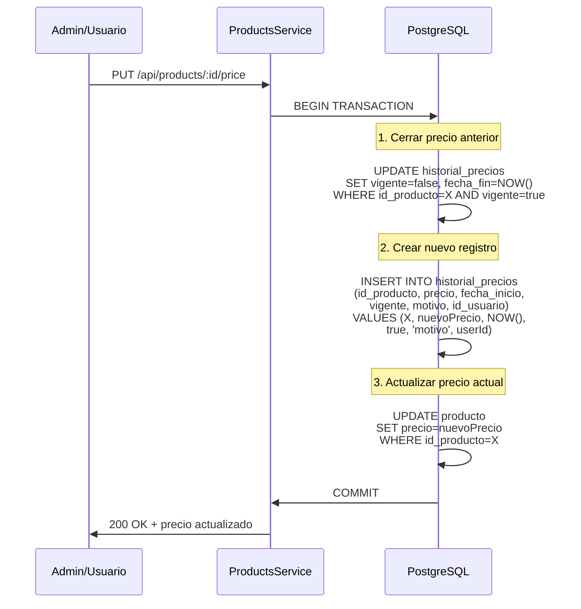

# Sistema de Historial de Precios de Productos

## Fecha de Implementación
**11 de Noviembre de 2025** - Migración `20251111165945_add_product_price_history`

---

## 1. Resumen Ejecutivo

Se implementó un sistema de seguimiento histórico de precios para productos, permitiendo registrar cambios de precio a lo largo del tiempo con auditoría de usuario responsable y motivo del cambio.

### Beneficios Clave
- **Auditoría completa**: Registro de quién cambió el precio y cuándo
- **Análisis temporal**: Capacidad de consultar precios históricos para reportes y análisis
- **Trazabilidad**: Motivo documentado para cada cambio de precio
- **Vigencia**: Sistema de validación de períodos activos/inactivos

---

## 2. Modelo de Datos

### 2.1 Tabla: `producto_historial_precio`

```sql
CREATE TABLE "public"."producto_historial_precio" (
    "id_historial"  BIGSERIAL PRIMARY KEY,
    "id_producto"   BIGINT NOT NULL,
    "precio"        DECIMAL(12,2) NOT NULL,
    "fecha_inicio"  TIMESTAMPTZ(6) NOT NULL DEFAULT CURRENT_TIMESTAMP,
    "fecha_fin"     TIMESTAMPTZ(6),
    "vigente"       BOOLEAN NOT NULL DEFAULT true,
    "motivo"        VARCHAR(200),
    "id_usuario"    BIGINT,
    "creado_en"     TIMESTAMPTZ(6) NOT NULL DEFAULT CURRENT_TIMESTAMP
);
```

#### Columnas

| Campo | Tipo | Nullable | Default | Descripción |
|-------|------|----------|---------|-------------|
| `id_historial` | BIGSERIAL | NO | auto | Identificador único del registro histórico |
| `id_producto` | BIGINT | NO | - | FK a `producto.id_producto` |
| `precio` | DECIMAL(12,2) | NO | - | Precio vigente en este período (hasta 2 decimales) |
| `fecha_inicio` | TIMESTAMPTZ(6) | NO | NOW() | Inicio de vigencia del precio |
| `fecha_fin` | TIMESTAMPTZ(6) | YES | NULL | Fin de vigencia (NULL = actual) |
| `vigente` | BOOLEAN | NO | true | Indica si este es el precio activo |
| `motivo` | VARCHAR(200) | YES | NULL | Razón del cambio (ej: "Promoción Black Friday") |
| `id_usuario` | BIGINT | YES | NULL | FK a `usuarios.id_usuario` (quien realizó el cambio) |
| `creado_en` | TIMESTAMPTZ(6) | NO | NOW() | Timestamp de creación del registro |

---

### 2.2 Índices

```sql
-- Búsqueda rápida de precio actual por producto
CREATE INDEX "producto_historial_precio_id_producto_vigente_idx" 
ON "public"."producto_historial_precio"("id_producto", "vigente");

-- Consultas de historial ordenadas por fecha
CREATE INDEX "producto_historial_precio_id_producto_fecha_inicio_idx" 
ON "public"."producto_historial_precio"("id_producto", "fecha_inicio");
```

#### Justificación de Índices

1. **`(id_producto, vigente)`**: 
   - Optimiza consulta frecuente: "¿Cuál es el precio actual de este producto?"
   - Evita full table scan en tablas con muchos registros históricos

2. **`(id_producto, fecha_inicio)`**: 
   - Facilita consultas temporales: "Precios del producto X en noviembre 2025"
   - Soporta reportes de evolución de precios con `ORDER BY fecha_inicio`

---

### 2.3 Relaciones (Foreign Keys)

#### FK a `producto`
```sql
ALTER TABLE "public"."producto_historial_precio" 
ADD CONSTRAINT "producto_historial_precio_id_producto_fkey" 
FOREIGN KEY ("id_producto") 
REFERENCES "public"."producto"("id_producto") 
ON DELETE CASCADE ON UPDATE CASCADE;
```

**Comportamiento**: 
- `ON DELETE CASCADE`: Si se elimina un producto, se borra todo su historial de precios
- `ON UPDATE CASCADE`: Propagación de cambios en `id_producto` (poco probable con autoincrement)

#### FK a `usuarios`
```sql
ALTER TABLE "public"."producto_historial_precio" 
ADD CONSTRAINT "producto_historial_precio_id_usuario_fkey" 
FOREIGN KEY ("id_usuario") 
REFERENCES "public"."usuarios"("id_usuario") 
ON DELETE SET NULL ON UPDATE CASCADE;
```

**Comportamiento**: 
- `ON DELETE SET NULL`: Si se elimina el usuario, se preserva el registro pero se pierde la referencia
- Permite mantener historial incluso después de baja de empleados

---

## 3. Schema Prisma

### 3.1 Modelo `producto_historial_precio`

```prisma
model producto_historial_precio {
  id_historial   BigInt    @id @default(autoincrement())
  id_producto    BigInt
  precio         Decimal   @db.Decimal(12, 2)
  fecha_inicio   DateTime  @default(now()) @db.Timestamptz(6)
  fecha_fin      DateTime? @db.Timestamptz(6)
  vigente        Boolean   @default(true)
  motivo         String?   @db.VarChar(200)
  id_usuario     BigInt?
  creado_en      DateTime  @default(now()) @db.Timestamptz(6)

  producto       producto  @relation(fields: [id_producto], references: [id_producto], onDelete: Cascade)
  usuario        usuarios? @relation(fields: [id_usuario], references: [id_usuario], onDelete: SetNull)

  @@index([id_producto, vigente])
  @@index([id_producto, fecha_inicio])
  @@map("producto_historial_precio")
}
```

### 3.2 Relación Inversa en `producto`

```prisma
model producto {
  id_producto                 BigInt                        @id @default(autoincrement())
  // ... otros campos ...
  historial_precios           producto_historial_precio[]   // ← NUEVO
  // ... otras relaciones ...
}
```

### 3.3 Relación Inversa en `usuarios`

```prisma
model usuarios {
  id_usuario                 BigInt                   @id @default(autoincrement())
  // ... otros campos ...
  producto_historial_precios producto_historial_precio[]  // ← NUEVO
  // ... otras relaciones ...
}
```

---

## 4. Coherencia Schema ↔ Base de Datos

### ✅ Verificación Realizada (11/11/2025 17:10 UTC)

```bash
# Estructura de tabla en PostgreSQL
docker exec filacero-postgres psql -U user -d filacero -c '\d producto_historial_precio'
```

**Resultado**:
- ✅ Todos los campos coinciden con el schema Prisma
- ✅ Tipos de datos correctos (DECIMAL(12,2), TIMESTAMPTZ(6), BOOLEAN)
- ✅ Constraints de PK y FK configuradas
- ✅ Índices creados correctamente
- ✅ Defaults aplicados (NOW(), true)

### Comparación Schema vs. DB

| Aspecto | Schema Prisma | Base de Datos PostgreSQL | Estado |
|---------|---------------|--------------------------|--------|
| Tabla mapeada | `producto_historial_precio` | `public.producto_historial_precio` | ✅ Coincide |
| Primary Key | `id_historial` autoincrement | `id_historial` BIGSERIAL | ✅ Coincide |
| Precio | `Decimal @db.Decimal(12, 2)` | `numeric(12,2)` | ✅ Coincide |
| Timestamps | `DateTime @db.Timestamptz(6)` | `timestamp(6) with time zone` | ✅ Coincide |
| FK producto | `onDelete: Cascade` | `ON DELETE CASCADE` | ✅ Coincide |
| FK usuario | `onDelete: SetNull` | `ON DELETE SET NULL` | ✅ Coincide |
| Índice vigencia | `@@index([id_producto, vigente])` | `producto_historial_precio_id_producto_vigente_idx` | ✅ Coincide |
| Índice fecha | `@@index([id_producto, fecha_inicio])` | `producto_historial_precio_id_producto_fecha_inicio_idx` | ✅ Coincide |

---

## 5. Funcionamiento del Sistema

### 5.1 Flujo de Cambio de Precio



### 5.2 Consultas Comunes

#### Obtener precio actual de un producto
```typescript
const precioActual = await prisma.producto_historial_precio.findFirst({
  where: {
    id_producto: productoId,
    vigente: true
  },
  include: {
    usuario: {
      select: { nombre: true, correo_electronico: true }
    }
  }
});
```

#### Historial completo de precios
```typescript
const historial = await prisma.producto_historial_precio.findMany({
  where: { id_producto: productoId },
  orderBy: { fecha_inicio: 'desc' },
  include: {
    usuario: {
      select: { nombre: true }
    }
  }
});
```

#### Precio en una fecha específica
```typescript
const precioEnFecha = await prisma.producto_historial_precio.findFirst({
  where: {
    id_producto: productoId,
    fecha_inicio: { lte: fechaConsulta },
    OR: [
      { fecha_fin: { gte: fechaConsulta } },
      { fecha_fin: null }
    ]
  }
});
```

#### Productos con más cambios de precio (últimos 30 días)
```typescript
const productosDinamicos = await prisma.producto_historial_precio.groupBy({
  by: ['id_producto'],
  where: {
    fecha_inicio: {
      gte: new Date(Date.now() - 30 * 24 * 60 * 60 * 1000)
    }
  },
  _count: { id_historial: true },
  orderBy: { _count: { id_historial: 'desc' } }
});
```

---

## 6. Reglas de Negocio Recomendadas

### 6.1 Validaciones

1. **Un solo precio vigente por producto**
   ```typescript
   // Antes de insertar nuevo precio:
   const vigentesActuales = await prisma.producto_historial_precio.count({
     where: { id_producto: X, vigente: true }
   });
   if (vigentesActuales > 0) {
     // Cerrar el anterior antes de crear nuevo
   }
   ```

2. **Precio no puede ser negativo**
   ```typescript
   if (nuevoPrecio <= 0) {
     throw new BadRequestException('Precio debe ser positivo');
   }
   ```

3. **Motivo obligatorio para cambios significativos**
   ```typescript
   const cambioSignificativo = Math.abs(precioAnterior - nuevoPrecio) / precioAnterior > 0.10; // >10%
   if (cambioSignificativo && !motivo) {
     throw new BadRequestException('Motivo requerido para cambios >10%');
   }
   ```

### 6.2 Permisos

| Acción | Rol Requerido | Descripción |
|--------|---------------|-------------|
| Leer historial | `viewer`, `cashier`, `admin` | Consulta de precios históricos |
| Crear precio | `admin`, `manager` | Registro de cambio de precio |
| Modificar historial | `admin` | Corrección de errores (auditable) |
| Eliminar registros | **PROHIBIDO** | Mantener integridad de auditoría |

---

## 7. Mejoras Implementadas

### 7.1 Respecto a Diseño Anterior

Si existía un campo `precio` directo en `producto` sin historial:

| Antes | Después | Mejora |
|-------|---------|--------|
| Un solo precio sin contexto | Historial completo con auditoría | ✅ Trazabilidad |
| No se sabe quién cambió | `id_usuario` registrado | ✅ Accountability |
| No se sabe cuándo cambió | `fecha_inicio` / `fecha_fin` | ✅ Timeline |
| No se sabe por qué cambió | Campo `motivo` | ✅ Documentación |
| Consultas de precio pasado imposibles | Consulta histórica con índices | ✅ Analytics |

### 7.2 Optimizaciones de Performance

1. **Índice compuesto `(id_producto, vigente)`**:
   - Consulta de precio actual: **O(log n)** en lugar de **O(n)**
   
2. **Índice compuesto `(id_producto, fecha_inicio)`**:
   - Consulta de rango temporal: **escaneo de índice** en lugar de full table scan

3. **Campo `vigente` redundante pero útil**:
   - Evita calcular `WHERE fecha_fin IS NULL` en cada consulta
   - Trade-off: 1 byte extra por registro vs. mejora en queries frecuentes

---

## 8. Migración y Rollback

### 8.1 Aplicación de Migración

```bash
# Dentro del contenedor backend
cd /app
npx prisma migrate deploy
```

**Estado actual**: Migración `20251111165945_add_product_price_history` aplicada exitosamente.

### 8.2 Rollback (Procedimiento de Emergencia)

⚠️ **DESTRUCTIVO**: Solo en entorno de desarrollo

```sql
-- 1. Eliminar foreign keys
ALTER TABLE producto_historial_precio DROP CONSTRAINT producto_historial_precio_id_producto_fkey;
ALTER TABLE producto_historial_precio DROP CONSTRAINT producto_historial_precio_id_usuario_fkey;

-- 2. Eliminar tabla
DROP TABLE producto_historial_precio;

-- 3. Eliminar registro de migración
DELETE FROM _prisma_migrations WHERE migration_name = '20251111165945_add_product_price_history';
```

**En producción**: 
- Crear migración inversa formal con `prisma migrate dev`
- Documentar razones del rollback
- Planificar re-aplicación corregida

---

## 9. Próximos Pasos Recomendados

### 9.1 Backend (NestJS)

1. **Crear DTOs**:
   ```typescript
   // src/products/dto/update-product-price.dto.ts
   export class UpdateProductPriceDto {
     @IsPositive()
     @IsDecimal({ decimal_digits: '2' })
     precio: Decimal;

     @IsOptional()
     @MaxLength(200)
     motivo?: string;
   }
   ```

2. **Crear servicio de historial**:
   ```typescript
   // src/products/product-price-history.service.ts
   async actualizarPrecio(
     idProducto: bigint, 
     nuevoPrecio: Decimal, 
     idUsuario: bigint, 
     motivo?: string
   ): Promise<void> {
     // Transacción con cierre de precio anterior + inserción nuevo
   }
   ```

3. **Endpoint dedicado**:
   ```typescript
   @Put(':id/price')
   @UseGuards(AuthGuard('jwt'), RolesGuard)
   @Roles('admin', 'manager')
   async updatePrice(
     @Param('id', ParseBigIntPipe) id: bigint,
     @Body() dto: UpdateProductPriceDto,
     @CurrentUser() user: Usuario
   ) { ... }
   ```

### 9.2 Frontend (Next.js)

1. **Componente de historial**:
   ```tsx
   // src/features/products/PriceHistoryTimeline.tsx
   export function PriceHistoryTimeline({ productId }: Props) {
     // Gráfico de línea con evolución de precios
     // Lista de cambios con usuario y motivo
   }
   ```

2. **Modal de cambio de precio**:
   ```tsx
   // Validación cliente + confirmación para cambios grandes
   // Campo obligatorio "motivo" si cambio > 10%
   ```

### 9.3 Seed de Datos de Prueba

```typescript
// Backend/prisma/seed.ts
// Agregar registros de historial para productos existentes
const productosConHistorial = await prisma.producto.findMany({ take: 5 });

for (const prod of productosConHistorial) {
  await prisma.producto_historial_precio.createMany({
    data: [
      {
        id_producto: prod.id_producto,
        precio: prod.precio * 0.9,
        fecha_inicio: new Date('2025-10-01'),
        fecha_fin: new Date('2025-10-31'),
        vigente: false,
        motivo: 'Precio inicial octubre'
      },
      {
        id_producto: prod.id_producto,
        precio: prod.precio,
        fecha_inicio: new Date('2025-11-01'),
        vigente: true,
        motivo: 'Ajuste noviembre'
      }
    ]
  });
}
```

---

## 10. Referencias Técnicas

### Documentación Consultada
- [Prisma Relations](https://www.prisma.io/docs/concepts/components/prisma-schema/relations)
- [Prisma Indexes](https://www.prisma.io/docs/concepts/components/prisma-schema/indexes)
- [PostgreSQL DECIMAL Type](https://www.postgresql.org/docs/current/datatype-numeric.html)
- [PostgreSQL Foreign Keys](https://www.postgresql.org/docs/current/ddl-constraints.html#DDL-CONSTRAINTS-FK)

### Archivos Modificados
- `Backend/prisma/schema.prisma`: Modelos `producto_historial_precio`, `producto`, `usuarios`
- `Backend/prisma/migrations/20251111165945_add_product_price_history/migration.sql`: Migración completa
- `Backend/generated/prisma/`: Cliente Prisma regenerado

---

## 11. Verificación Final

```bash
# Estado de migraciones
docker exec filacero-backend sh -lc 'cd /app && npx prisma migrate status'
# Output: "Database schema is up to date!"

# Estructura de tabla
docker exec filacero-postgres psql -U user -d filacero -c '\d producto_historial_precio'
# Output: Tabla con 9 columnas, 2 índices, 2 FKs

# Cliente Prisma
docker exec filacero-backend sh -lc 'cd /app && npx prisma generate'
# Output: "Generated Prisma Client (v6.16.2)"
```

✅ **Sistema completamente funcional y listo para desarrollo de lógica de negocio.**

---

**Documentado por**: GitHub Copilot  
**Fecha**: 11 de Noviembre de 2025  
**Versión**: 1.0
