# Plan Estratégico: Sistema de Pedidos Online → POS Kanban → Notificaciones

**Fecha:** 2025-01-04  
**Versión:** 1.0  
**Objetivo:** Diseñar e implementar flujo completo para que estudiantes compren productos en tienda online, los empleados reciban notificaciones en POS, gestionen pedidos mediante tablero Kanban (cola → en proceso → finalizado), y el cliente reciba notificaciones de cambios de estado.

---

## 1. Contexto del Proyecto

### 1.1 Arquitectura Actual
FilaCero cuenta con:
- **Backend NestJS + Prisma** con módulos `auth`, `businesses`, `products`, `inventory`, `sales`, `categories`, `users`, `roles`, `business-ratings`
- **Frontend Next.js 13 App Router** con páginas `/shop` (tienda pública), `/stores/[id]` (catálogo por negocio), `/checkout` (carrito), `/pos` (POS con carrito y productos)
- **Base de datos PostgreSQL** con tablas `venta`, `detalle_venta`, `inventario`, `usuarios`, `negocio`, `productos`, etc.
- **Sistema de ventas básico:** `POST /api/sales` crea ventas con estado `pagada` o `abierta`, actualiza inventario automáticamente vía triggers
- **Carrito de compra:** contexto React (`CartContext`) en frontend con almacenamiento local, checkout básico llama `POST /api/sales`

### 1.2 Gaps Identificados
1. **No existe módulo de notificaciones** (carpeta `Backend/src/notifications` vacía)
2. **No hay comunicación en tiempo real** (WebSockets/SSE no implementados)
3. **El modelo `venta` tiene campo `estado`** pero no hay estados intermedios para pedidos online (pendiente → confirmado → en preparación → listo → entregado)
4. **No existe tablero Kanban en POS** para visualizar pedidos en diferentes fases
5. **No hay distinción** entre ventas POS inmediatas vs. pedidos online con preparación diferida
6. **No hay sistema de notificaciones** para clientes (email/SMS al cambiar estado del pedido)

---

## 2. Propuesta de Arquitectura

### 2.1 Modelos de Datos (Prisma Schema)

#### **2.1.1 Nuevo Modelo: `pedido` (Order)**
Separar pedidos online de ventas POS directas:

```prisma
model pedido {
  id_pedido              BigInt                   @id @default(autoincrement())
  id_negocio             BigInt
  id_usuario             BigInt?                  // Cliente que ordenó (null para anónimos)
  id_tipo_pago           BigInt?                  
  estado                 String                   @default("pendiente") @db.VarChar(30)
  // Estados: pendiente, confirmado, en_preparacion, listo, entregado, cancelado
  
  fecha_creacion         DateTime                 @default(now()) @db.Timestamptz(6)
  fecha_confirmacion     DateTime?                @db.Timestamptz(6)
  fecha_preparacion      DateTime?                @db.Timestamptz(6)
  fecha_listo            DateTime?                @db.Timestamptz(6)
  fecha_entrega          DateTime?                @db.Timestamptz(6)
  
  total                  Decimal                  @db.Decimal(14, 2)
  notas_cliente          String?                  @db.Text
  tiempo_entrega         String?                  @db.VarChar(50) // "15-20 min", "12:30 PM"
  
  // Datos de contacto para anónimos
  nombre_cliente         String?                  @db.VarChar(100)
  email_cliente          String?                  @db.VarChar(100)
  telefono_cliente       String?                  @db.VarChar(20)
  
  creado_en              DateTime                 @default(now()) @db.Timestamptz(6)
  actualizado_en         DateTime                 @updatedAt @db.Timestamptz(6)
  
  detalle_pedido         detalle_pedido[]
  notificaciones         notificacion[]
  negocio                negocio                  @relation(fields: [id_negocio], references: [id_negocio], onDelete: Cascade)
  usuario                usuarios?                @relation(fields: [id_usuario], references: [id_usuario], onDelete: SetNull)
  tipo_pago              tipo_pago?               @relation(fields: [id_tipo_pago], references: [id_tipo_pago])
  
  @@index([id_negocio, estado])
  @@index([id_usuario])
  @@index([fecha_creacion])
  @@map("pedido")
}

model detalle_pedido {
  id_detalle             BigInt                   @id @default(autoincrement())
  id_pedido              BigInt
  id_producto            BigInt
  cantidad               Int
  precio_unitario        Decimal                  @db.Decimal(10, 2)
  notas                  String?                  @db.Text // "sin cebolla", "extra queso"
  
  pedido                 pedido                   @relation(fields: [id_pedido], references: [id_pedido], onDelete: Cascade)
  producto               product                  @relation(fields: [id_producto], references: [id_producto])
  
  @@index([id_pedido])
  @@map("detalle_pedido")
}
```

#### **2.1.2 Nuevo Modelo: `notificacion` (Notification)**
Registro de notificaciones enviadas/leídas:

```prisma
model notificacion {
  id_notificacion        BigInt                   @id @default(autoincrement())
  id_usuario             BigInt?                  // null = notificación de sistema
  id_negocio             BigInt?                  
  id_pedido              BigInt?
  
  tipo                   String                   @db.VarChar(30)
  // Tipos: pedido_nuevo, pedido_confirmado, pedido_listo, pedido_cancelado, stock_bajo, venta_diaria
  
  titulo                 String                   @db.VarChar(200)
  mensaje                String                   @db.Text
  leida                  Boolean                  @default(false)
  
  canal                  String?                  @db.VarChar(20) // email, sms, push, in_app
  enviada_en             DateTime?                @db.Timestamptz(6)
  leida_en               DateTime?                @db.Timestamptz(6)
  
  creado_en              DateTime                 @default(now()) @db.Timestamptz(6)
  
  usuario                usuarios?                @relation(fields: [id_usuario], references: [id_usuario], onDelete: Cascade)
  negocio                negocio?                 @relation(fields: [id_negocio], references: [id_negocio], onDelete: Cascade)
  pedido                 pedido?                  @relation(fields: [id_pedido], references: [id_pedido], onDelete: Cascade)
  
  @@index([id_usuario, leida])
  @@index([id_negocio, tipo])
  @@index([creado_en])
  @@map("notificacion")
}
```

#### **2.1.3 Actualización: Agregar Relaciones en Modelos Existentes**
```prisma
// En model usuarios:
  pedidos                pedido[]
  notificaciones         notificacion[]

// En model negocio:
  pedidos                pedido[]
  notificaciones         notificacion[]

// En model product:
  detalle_pedido         detalle_pedido[]
```

---

### 2.1.4 Implementaciones necesarias en la base de datos (migraciones, triggers y seeds)

Esta sección contiene las instrucciones concretas que deben ejecutarse en la base de datos (o incluirse en la migración Prisma) para soportar el nuevo flujo de pedidos, mantener coherencia de inventario y ofrecer historial de notificaciones.

1) Estrategia de migración
- Usar Prisma para crear los modelos (`pedido`, `detalle_pedido`, `notificacion`) en `prisma/schema.prisma` (ya incluidos en esta propuesta).  
- Generar la migración con el nombre `add_orders_system` y verificar el SQL que Prisma genera.  

Comandos (desarrollo local dentro del contenedor backend):
```powershell
# Si trabajas en desarrollo con código fuente montado
docker compose build backend ; # rebuild si hay cambios en prisma/migrations
docker compose exec backend npx prisma migrate dev --name add_orders_system
docker compose exec backend npx prisma generate
```

Para despliegues automatizados (CI/CD / producción) preferir `migrate deploy`:
```powershell
docker compose exec backend npx prisma migrate deploy
docker compose exec backend npx prisma generate
```

2) Check constraints y enumeraciones
- Agregar una constraint que limite `estado` a los valores esperados. Prisma no añade enums automáticos en SQL salvo que se declare, por lo que la migración puede incluir una comprobación (`CHECK`) o crear un `TYPE` PostgreSQL. Ejemplo SQL (puede añadirse en el archivo `migration.sql` generado por Prisma):

```sql
-- Opción CHECK (simple)
ALTER TABLE pedido
  ADD CONSTRAINT pedido_estado_check CHECK (estado IN ('pendiente','confirmado','en_preparacion','listo','entregado','cancelado'));

-- Opción TYPE (más estricto)
DO $$ BEGIN
  IF NOT EXISTS (SELECT 1 FROM pg_type WHERE typname = 'pedido_estado') THEN
    CREATE TYPE pedido_estado AS ENUM ('pendiente','confirmado','en_preparacion','listo','entregado','cancelado');
    ALTER TABLE pedido ALTER COLUMN estado TYPE pedido_estado USING estado::pedido_estado;
  END IF;
END$$;
```

3) Funciones y triggers para movimientos de inventario
El flujo recomendado: **no descontar inventario al crear** el pedido, sólo al confirmar (`estado -> en_preparacion`). Para garantizar consistencia y auditoría, agregar:

- Función que descuenta inventario y registra movimiento

```sql
CREATE OR REPLACE FUNCTION fn_movimiento_inventario_on_confirm() RETURNS TRIGGER AS $$
DECLARE
  item RECORD;
  inv RECORD;
BEGIN
  -- Para cada detalle del pedido, validar y descontar
  FOR item IN SELECT * FROM detalle_pedido WHERE id_pedido = NEW.id_pedido LOOP
    SELECT * INTO inv FROM inventario WHERE id_negocio = NEW.id_negocio AND id_producto = item.id_producto FOR UPDATE;
    IF inv IS NULL THEN
      RAISE EXCEPTION 'Inventario no encontrado para producto % en negocio %', item.id_producto, NEW.id_negocio;
    END IF;
    IF inv.cantidad_actual < item.cantidad THEN
      RAISE EXCEPTION 'Stock insuficiente para producto %: disponible % < requerido %', item.id_producto, inv.cantidad_actual, item.cantidad;
    END IF;

    UPDATE inventario
      SET cantidad_actual = cantidad_actual - item.cantidad
    WHERE id_negocio = NEW.id_negocio AND id_producto = item.id_producto;

    INSERT INTO movimientos_inventario (id_negocio, id_producto, cantidad_delta, motivo, id_venta, id_pedido, creado_en)
    VALUES (NEW.id_negocio, item.id_producto, -item.cantidad, 'pedido_online_confirm', NULL, NEW.id_pedido, now());
  END LOOP;

  RETURN NEW;
END;
$$ LANGUAGE plpgsql;

CREATE TRIGGER trg_pedido_after_confirm
AFTER UPDATE ON pedido
FOR EACH ROW
WHEN (OLD.estado IS DISTINCT FROM NEW.estado AND NEW.estado = 'en_preparacion')
EXECUTE PROCEDURE fn_movimiento_inventario_on_confirm();
```

- Función que restaura inventario cuando un pedido se cancela (si ya se había descontado). Recomendamos llevar una marca/flag en `pedido` indicando si el inventario ya fue aplicado (`inventario_aplicado boolean default false`) para evitar dobles ajustes. Si se añade ese campo, la función revisará y restaurará sólo cuando sea necesario.

```sql
CREATE OR REPLACE FUNCTION fn_restore_inventory_on_cancel() RETURNS TRIGGER AS $$
DECLARE
  item RECORD;
  inv RECORD;
BEGIN
  IF OLD.estado = 'en_preparacion' AND NEW.estado = 'cancelado' THEN
    -- Restaurar por cada ítem
    FOR item IN SELECT * FROM detalle_pedido WHERE id_pedido = OLD.id_pedido LOOP
      UPDATE inventario
        SET cantidad_actual = cantidad_actual + item.cantidad
      WHERE id_negocio = OLD.id_negocio AND id_producto = item.id_producto;

      INSERT INTO movimientos_inventario (id_negocio, id_producto, cantidad_delta, motivo, id_venta, id_pedido, creado_en)
      VALUES (OLD.id_negocio, item.id_producto, item.cantidad, 'pedido_cancel_restore', NULL, OLD.id_pedido, now());
    END LOOP;
  END IF;

  RETURN NEW;
END;
$$ LANGUAGE plpgsql;

CREATE TRIGGER trg_pedido_after_cancel
AFTER UPDATE ON pedido
FOR EACH ROW
WHEN (OLD.estado IS DISTINCT FROM NEW.estado AND NEW.estado = 'cancelado')
EXECUTE PROCEDURE fn_restore_inventory_on_cancel();
```

4) Auditoría y timestamps
- Asegurarse que `pedido` tiene `creado_en` y `actualizado_en` y que `movimientos_inventario` incluye `creado_en` y referencias a `id_pedido` y `id_venta` (ya presente en el esquema DB actual). Esto ayuda a reconciliar movimientos.

5) Seeds iniciales (ejemplo)
Agregar un script de seed (`prisma/seed.ts` o SQL) que inserte tipos de pago y un pedido demo:

Prisma seed (TypeScript) ejemplo:
```ts
import { PrismaClient } from '@prisma/client';
const prisma = new PrismaClient();

async function main() {
  await prisma.tipo_pago.upsert({ where: { id_tipo_pago: 1 }, update: {}, create: { id_tipo_pago: 1, nombre: 'efectivo' } });
  await prisma.tipo_pago.upsert({ where: { id_tipo_pago: 2 }, update: {}, create: { id_tipo_pago: 2, nombre: 'tarjeta' } });

  // Pedido demo opcional (para pruebas locales)
  // const pedido = await prisma.pedido.create({ data: { id_negocio: 1, estado: 'pendiente', total: new Prisma.Decimal(0), creado_en: new Date() } });
}

main().catch(console.error).finally(() => prisma.$disconnect());
```

Y en `package.json` del backend:
```json
"prisma": {
  "seed": "ts-node -r tsconfig-paths/register prisma/seed.ts"
}
```

6) Scripts de verificación y rollback
- Comandos útiles para inspeccionar migraciones y estado:
```powershell
docker compose exec backend npx prisma migrate status
docker compose exec backend npx prisma db pull # inspeccionar esquema en DB
docker compose exec backend npx prisma migrate resolve --applied <migration_name> # en caso de reconciliación manual
```

- Para rollback (solo en desarrollo):
```powershell
docker compose exec backend npx prisma migrate reset --force
```

7) Notas operacionales y backups
- Antes de aplicar migraciones en producción, hacer snapshot/backup de la base de datos (pg_dump) y revisar el SQL generado por Prisma.  
- Cuando añadamos funciones/triggers es recomendable incluirlas como archivos SQL en la carpeta `prisma/migrations/<timestamp>_add_orders_system/` para que Prisma los aplique de forma determinista.

8) Recomendaciones de integridad y performance
- Añadir índices a `detalle_pedido.id_pedido` (ya en esquema propuesto) y a `notificacion.id_usuario`/`id_negocio`.  
- Considerar particionado o TTL en `notificacion` si el volumen crece mucho; archivar notificaciones antiguas.

---


### 2.2 Backend: Nuevos Módulos NestJS

#### **2.2.1 Módulo `orders/` (Pedidos Online)**

**Estructura:**
```
Backend/src/orders/
├── dto/
│   ├── create-order.dto.ts
│   ├── update-order-state.dto.ts
│   └── order-filters.dto.ts
├── orders.controller.ts
├── orders.service.ts
├── orders.module.ts
└── __tests__/
    └── orders.service.spec.ts
```

**Endpoints:**

| Método | Ruta | Descripción | Auth | Roles |
|--------|------|-------------|------|-------|
| POST | `/api/orders` | Crear pedido (checkout tienda) | Opcional | N/A |
| GET | `/api/orders` | Listar pedidos (filtro por negocio/usuario/estado) | JWT | admin, empleado |
| GET | `/api/orders/:id` | Detalle de pedido con items | JWT | propietario/empleado |
| PATCH | `/api/orders/:id/confirm` | Confirmar pedido (cola → en_preparacion) | JWT | admin, empleado |
| PATCH | `/api/orders/:id/start` | Iniciar preparación | JWT | admin, empleado |
| PATCH | `/api/orders/:id/complete` | Marcar como listo | JWT | admin, empleado |
| PATCH | `/api/orders/:id/deliver` | Marcar como entregado | JWT | admin, empleado |
| PATCH | `/api/orders/:id/cancel` | Cancelar pedido | JWT | admin, empleado |
| GET | `/api/orders/business/:id/pending` | Pedidos pendientes para Kanban | JWT | admin, empleado |

**Lógica de Negocio (`orders.service.ts`):**
- `create()`: valida stock, crea pedido en estado `pendiente`, NO descuenta inventario aún (solo cuando se confirma)
- `confirm()`: cambia a `en_preparacion`, descuenta inventario, emite evento WebSocket `order:confirmed`
- `start()`: cambia a `en_preparacion` (si venía de `confirmado`), emite `order:started`
- `complete()`: cambia a `listo`, emite `order:ready`, dispara notificación al cliente
- `deliver()`: cambia a `entregado`, emite `order:delivered`
- `cancel()`: restaura inventario si ya fue descontado, emite `order:cancelled`

**DTOs:**
```typescript
// create-order.dto.ts
export class CreateOrderDto {
  @IsNotEmpty()
  @IsString()
  id_negocio: string;

  @IsOptional()
  @IsString()
  id_usuario?: string;

  @IsArray()
  @ArrayMinSize(1)
  @ValidateNested({ each: true })
  @Type(() => OrderItemDto)
  items: OrderItemDto[];

  @IsOptional()
  @IsString()
  tiempo_entrega?: string;

  @IsOptional()
  @IsString()
  id_tipo_pago?: string;

  @IsOptional()
  @IsString()
  nombre_cliente?: string;

  @IsOptional()
  @IsEmail()
  email_cliente?: string;

  @IsOptional()
  @IsString()
  telefono_cliente?: string;

  @IsOptional()
  @IsString()
  notas_cliente?: string;
}

class OrderItemDto {
  @IsString()
  id_producto: string;

  @IsInt()
  @Min(1)
  cantidad: number;

  @IsOptional()
  @IsString()
  notas?: string;
}
```

```typescript
// update-order-state.dto.ts
export class UpdateOrderStateDto {
  @IsEnum(['confirmado', 'en_preparacion', 'listo', 'entregado', 'cancelado'])
  estado: string;

  @IsOptional()
  @IsString()
  motivo_cancelacion?: string;
}
```

---

#### **2.2.2 Módulo `notifications/` (Notificaciones)**

**Estructura:**
```
Backend/src/notifications/
├── dto/
│   ├── create-notification.dto.ts
│   └── notification-filters.dto.ts
├── notifications.controller.ts
├── notifications.service.ts
├── notifications.gateway.ts  // WebSocket Gateway
├── notifications.module.ts
└── providers/
    ├── email.provider.ts     // SendGrid/Resend
    └── sms.provider.ts       // Twilio (futuro)
```

**Endpoints:**

| Método | Ruta | Descripción | Auth |
|--------|------|-------------|------|
| GET | `/api/notifications` | Listar notificaciones del usuario | JWT |
| GET | `/api/notifications/unread` | Cantidad de no leídas | JWT |
| PATCH | `/api/notifications/:id/read` | Marcar como leída | JWT |
| PATCH | `/api/notifications/read-all` | Marcar todas como leídas | JWT |

**WebSocket Gateway (`notifications.gateway.ts`):**
```typescript
@WebSocketGateway({
  cors: { origin: process.env.FRONTEND_URL, credentials: true },
  namespace: 'notifications'
})
export class NotificationsGateway implements OnGatewayConnection, OnGatewayDisconnect {
  @WebSocketServer() server: Server;
  
  // Map: userId -> socketId
  private userSockets = new Map<string, string>();

  afterInit() {
    this.logger.log('WebSocket Notifications Gateway initialized');
  }

  handleConnection(client: Socket) {
    const userId = this.extractUserIdFromToken(client);
    if (userId) {
      this.userSockets.set(userId, client.id);
      client.join(`user:${userId}`);
    }
  }

  handleDisconnect(client: Socket) {
    const userId = this.findUserBySocketId(client.id);
    if (userId) this.userSockets.delete(userId);
  }

  // Métodos de emisión
  emitToUser(userId: string, event: string, data: any) {
    this.server.to(`user:${userId}`).emit(event, data);
  }

  emitToBusiness(businessId: string, event: string, data: any) {
    this.server.to(`business:${businessId}`).emit(event, data);
  }

  // Eventos de pedidos
  notifyNewOrder(businessId: string, order: any) {
    this.emitToBusiness(businessId, 'order:new', order);
  }

  notifyOrderStateChange(userId: string, order: any) {
    this.emitToUser(userId, 'order:state_changed', order);
  }
}
```

**Servicio (`notifications.service.ts`):**
```typescript
@Injectable()
export class NotificationsService {
  constructor(
    private prisma: PrismaService,
    private gateway: NotificationsGateway,
    private emailProvider: EmailProvider
  ) {}

  async createNotification(dto: {
    id_usuario?: bigint;
    id_negocio?: bigint;
    id_pedido?: bigint;
    tipo: string;
    titulo: string;
    mensaje: string;
    canal?: string;
  }) {
    const notification = await this.prisma.notificacion.create({ data: dto });

    // Emitir en tiempo real si el usuario está conectado
    if (dto.id_usuario) {
      this.gateway.emitToUser(dto.id_usuario.toString(), 'notification:new', notification);
    }

    // Enviar email si canal incluye 'email'
    if (dto.canal?.includes('email')) {
      // await this.emailProvider.send(...)
    }

    return notification;
  }

  async notifyOrderStateChange(pedidoId: bigint) {
    const pedido = await this.prisma.pedido.findUnique({
      where: { id_pedido: pedidoId },
      include: { usuario: true, negocio: true }
    });

    if (!pedido) return;

    const messages = {
      confirmado: 'Tu pedido ha sido confirmado y está en cola.',
      en_preparacion: '¡Tu pedido está siendo preparado!',
      listo: '✅ Tu pedido está listo para recoger.',
      entregado: 'Pedido entregado. ¡Gracias por tu compra!',
      cancelado: 'Tu pedido ha sido cancelado.'
    };

    await this.createNotification({
      id_usuario: pedido.id_usuario,
      id_pedido: pedido.id_pedido,
      tipo: `pedido_${pedido.estado}`,
      titulo: `Pedido #${pedido.id_pedido}`,
      mensaje: messages[pedido.estado] || 'Estado actualizado',
      canal: 'in_app,email'
    });
  }
}
```

---

### 2.3 Frontend: Nuevas Interfaces y Componentes

#### **2.3.1 Actualizar `/checkout` para Crear Pedidos**

**Archivo:** `Frontend/app/checkout/page.tsx`

**Cambio:**
Reemplazar `api.createSale(saleData)` por `api.createOrder(orderData)`:

```typescript
const handleConfirm = async () => {
  if (!canConfirm) return;
  setIsSubmitting(true);
  try {
    const orderData = {
      id_negocio: localStorage.getItem("active_business_id") || "1",
      id_tipo_pago: paymentMethod === "efectivo" ? "1" : "2",
      items: items.map((it) => ({
        id_producto: it.id,
        cantidad: it.cantidad,
        notas: it.notas || ""
      })),
      tiempo_entrega: deliveryTime,
      nombre_cliente: localStorage.getItem("user_name") || "",
      email_cliente: localStorage.getItem("user_email") || "",
      telefono_cliente: localStorage.getItem("user_phone") || "",
      notas_cliente: notes
    };
    
    const newOrder = await api.createOrder(orderData);
    clearCart();
    router.push(`/order-confirmation/${newOrder.id_pedido}`);
  } catch (err) {
    console.error("Error al confirmar:", err);
    alert("No se pudo crear el pedido. Intenta de nuevo.");
  } finally {
    setIsSubmitting(false);
  }
};
```

**Agregar endpoint en `api.ts`:**
```typescript
// Frontend/src/lib/api.ts
createOrder: (data: {
  id_negocio: string;
  id_tipo_pago?: string;
  items: Array<{ id_producto: string; cantidad: number; notas?: string }>;
  tiempo_entrega?: string;
  nombre_cliente?: string;
  email_cliente?: string;
  telefono_cliente?: string;
  notas_cliente?: string;
}) => apiFetch<any>('orders', { method: 'POST', body: JSON.stringify(data) }),

getOrders: (params?: { id_negocio?: string; estado?: string }) =>
  apiFetch<any[]>('orders', { params }),

getOrder: (id: string) =>
  apiFetch<any>(`orders/${id}`),

confirmOrder: (id: string) =>
  apiFetch<any>(`orders/${id}/confirm`, { method: 'PATCH' }),

startOrder: (id: string) =>
  apiFetch<any>(`orders/${id}/start`, { method: 'PATCH' }),

completeOrder: (id: string) =>
  apiFetch<any>(`orders/${id}/complete`, { method: 'PATCH' }),

deliverOrder: (id: string) =>
  apiFetch<any>(`orders/${id}/deliver`, { method: 'PATCH' }),

cancelOrder: (id: string, motivo?: string) =>
  apiFetch<any>(`orders/${id}/cancel`, { method: 'PATCH', body: JSON.stringify({ motivo_cancelacion: motivo }) })
```

---

#### **2.3.2 Página de Confirmación de Pedido**

**Archivo:** `Frontend/app/order-confirmation/[id]/page.tsx`

```tsx
"use client";
import { useEffect, useState } from "react";
import { useParams, useRouter } from "next/navigation";
import { api } from "../../../src/lib/api";
import NavbarStore from "../../../src/components/shop/navbarStore";

export default function OrderConfirmationPage() {
  const { id } = useParams();
  const router = useRouter();
  const [order, setOrder] = useState<any>(null);
  const [loading, setLoading] = useState(true);

  useEffect(() => {
    if (!id) return;
    
    const fetchOrder = async () => {
      try {
        const data = await api.getOrder(id as string);
        setOrder(data);
      } catch (err) {
        console.error(err);
      } finally {
        setLoading(false);
      }
    };
    
    fetchOrder();
  }, [id]);

  if (loading) return <div className="min-h-screen flex items-center justify-center">Cargando...</div>;
  if (!order) return <div className="min-h-screen flex items-center justify-center">Pedido no encontrado</div>;

  return (
    <div className="min-h-screen bg-gray-50">
      <NavbarStore />
      
      <main className="pt-24 pb-16 px-6 max-w-2xl mx-auto">
        <div className="bg-white rounded-2xl shadow-lg p-8 text-center">
          <div className="w-20 h-20 bg-green-100 rounded-full flex items-center justify-center mx-auto mb-6">
            <svg className="w-10 h-10 text-green-600" fill="none" stroke="currentColor" viewBox="0 0 24 24">
              <path strokeLinecap="round" strokeLinejoin="round" strokeWidth={2} d="M5 13l4 4L19 7" />
            </svg>
          </div>
          
          <h1 className="text-3xl font-bold mb-2">¡Pedido Confirmado!</h1>
          <p className="text-gray-600 mb-6">Tu pedido #{order.id_pedido} ha sido recibido</p>
          
          <div className="bg-gray-50 rounded-lg p-6 mb-6 text-left">
            <div className="flex justify-between mb-3">
              <span className="font-medium">Estado:</span>
              <span className="px-3 py-1 bg-yellow-100 text-yellow-800 rounded-full text-sm font-medium">
                {order.estado}
              </span>
            </div>
            <div className="flex justify-between mb-3">
              <span className="font-medium">Tiempo estimado:</span>
              <span>{order.tiempo_entrega || "15-20 min"}</span>
            </div>
            <div className="flex justify-between">
              <span className="font-medium">Total:</span>
              <span className="text-xl font-bold text-green-600">${order.total}</span>
            </div>
          </div>
          
          <div className="space-y-3">
            <button
              onClick={() => router.push("/user")}
              className="w-full py-3 bg-brand-500 hover:bg-brand-600 text-white rounded-lg font-medium transition"
            >
              Ver mis pedidos
            </button>
            <button
              onClick={() => router.push("/shop")}
              className="w-full py-3 border border-gray-300 hover:bg-gray-50 rounded-lg font-medium transition"
            >
              Seguir comprando
            </button>
          </div>
        </div>
      </main>
    </div>
  );
}
```

---

#### **2.3.3 Tablero Kanban en POS**

**Archivo:** `Frontend/app/pos/orders/page.tsx`

```tsx
"use client";
import { useEffect, useState } from "react";
import { api } from "../../../src/lib/api";
import { io, Socket } from "socket.io-client";

type Order = {
  id_pedido: string;
  estado: string;
  total: number;
  fecha_creacion: string;
  detalle_pedido: Array<{ producto: { nombre: string }; cantidad: number }>;
  nombre_cliente?: string;
};

const columns = [
  { id: "pendiente", title: "Cola", color: "bg-yellow-100 border-yellow-300" },
  { id: "en_preparacion", title: "En Proceso", color: "bg-blue-100 border-blue-300" },
  { id: "listo", title: "Finalizado", color: "bg-green-100 border-green-300" }
];

export default function POSOrdersPage() {
  const [orders, setOrders] = useState<Order[]>([]);
  const [socket, setSocket] = useState<Socket | null>(null);

  useEffect(() => {
    fetchOrders();
    
    // Conectar WebSocket
    const businessId = localStorage.getItem("active_business_id");
    const newSocket = io(`${process.env.NEXT_PUBLIC_API_BASE}/notifications`, {
      transports: ["websocket"],
      auth: { token: localStorage.getItem("auth_token") }
    });
    
    newSocket.on("connect", () => {
      console.log("✅ WebSocket conectado");
      newSocket.emit("join", `business:${businessId}`);
    });
    
    newSocket.on("order:new", (order) => {
      console.log("🔔 Nuevo pedido recibido:", order);
      setOrders(prev => [...prev, order]);
      playNotificationSound();
    });
    
    newSocket.on("order:state_changed", (order) => {
      setOrders(prev => prev.map(o => o.id_pedido === order.id_pedido ? order : o));
    });
    
    setSocket(newSocket);
    
    return () => {
      newSocket.close();
    };
  }, []);

  const fetchOrders = async () => {
    try {
      const businessId = localStorage.getItem("active_business_id");
      const data = await api.getOrders({ id_negocio: businessId, estado: "pendiente,en_preparacion,listo" });
      setOrders(data);
    } catch (err) {
      console.error(err);
    }
  };

  const handleStateChange = async (orderId: string, newState: string) => {
    try {
      const actions = {
        pendiente: () => api.confirmOrder(orderId),
        en_preparacion: () => api.startOrder(orderId),
        listo: () => api.completeOrder(orderId)
      };
      
      await actions[newState]();
      fetchOrders(); // Refresh
    } catch (err) {
      console.error(err);
    }
  };

  const playNotificationSound = () => {
    const audio = new Audio("/sounds/notification.mp3");
    audio.play().catch(console.error);
  };

  return (
    <div className="min-h-screen bg-gray-50 p-6">
      <header className="mb-6">
        <h1 className="text-3xl font-bold">📦 Gestión de Pedidos</h1>
        <p className="text-gray-600">Arrastra las tarjetas para cambiar el estado</p>
      </header>
      
      <div className="grid grid-cols-1 md:grid-cols-3 gap-6">
        {columns.map(col => (
          <div key={col.id} className={`rounded-lg border-2 p-4 ${col.color}`}>
            <h2 className="text-lg font-bold mb-4">{col.title}</h2>
            
            <div className="space-y-3">
              {orders
                .filter(o => o.estado === col.id)
                .map(order => (
                  <div key={order.id_pedido} className="bg-white rounded-lg shadow p-4">
                    <div className="flex justify-between items-start mb-2">
                      <span className="font-bold text-lg">#{order.id_pedido}</span>
                      <span className="text-sm text-gray-500">
                        {new Date(order.fecha_creacion).toLocaleTimeString('es-ES', { hour: '2-digit', minute: '2-digit' })}
                      </span>
                    </div>
                    
                    <p className="text-sm text-gray-700 mb-3">
                      {order.nombre_cliente || "Cliente anónimo"}
                    </p>
                    
                    <ul className="text-xs text-gray-600 mb-3 space-y-1">
                      {order.detalle_pedido?.slice(0, 3).map((item, idx) => (
                        <li key={idx}>• {item.cantidad}x {item.producto.nombre}</li>
                      ))}
                    </ul>
                    
                    <div className="flex justify-between items-center">
                      <span className="font-bold text-green-600">${order.total}</span>
                      
                      {col.id !== "listo" && (
                        <button
                          onClick={() => handleStateChange(order.id_pedido, col.id === "pendiente" ? "en_preparacion" : "listo")}
                          className="px-3 py-1 bg-blue-500 hover:bg-blue-600 text-white text-xs rounded-lg transition"
                        >
                          {col.id === "pendiente" ? "Confirmar" : "Completar"}
                        </button>
                      )}
                    </div>
                  </div>
                ))}
            </div>
          </div>
        ))}
      </div>
    </div>
  );
}
```

**Agregar enlace en sidebar POS:**
```tsx
// Frontend/app/pos/page.tsx o componente de navegación
<Link href="/pos/orders" className="nav-item">
  📦 Pedidos
</Link>
```

---

#### **2.3.4 Notificaciones en Navbar del Cliente**

**Archivo:** `Frontend/src/components/shop/navbarStore.tsx`

Actualizar para consumir WebSocket de notificaciones:

```tsx
useEffect(() => {
  if (!isAuthenticated) return;
  
  const socket = io(`${process.env.NEXT_PUBLIC_API_BASE}/notifications`, {
    transports: ["websocket"],
    auth: { token: localStorage.getItem("auth_token") }
  });
  
  socket.on("notification:new", (notification) => {
    setNotifications(prev => [notification, ...prev]);
    playNotificationSound();
  });
  
  return () => socket.close();
}, [isAuthenticated]);
```

---

### 2.4 Flujo Completo del Sistema

```mermaid
sequenceDiagram
    participant Cliente as 🛒 Cliente (Shop)
    participant FrontStore as Frontend Tienda
    participant Backend as Backend API
    participant DB as PostgreSQL
    participant WSGateway as WebSocket Gateway
    participant POSFront as Frontend POS
    participant Empleado as 👨‍🍳 Empleado POS

    Cliente->>FrontStore: 1. Selecciona productos
    FrontStore->>FrontStore: 2. Agrega al carrito (local)
    Cliente->>FrontStore: 3. Checkout (confirma pedido)
    FrontStore->>Backend: 4. POST /api/orders
    Backend->>DB: 5. INSERT pedido (estado=pendiente)
    Backend->>WSGateway: 6. Emitir order:new a business
    WSGateway->>POSFront: 7. Notificación en tiempo real
    POSFront->>Empleado: 8. 🔔 Aparece en columna "Cola"
    Backend->>FrontStore: 9. Respuesta con id_pedido
    FrontStore->>Cliente: 10. Muestra confirmación

    Empleado->>POSFront: 11. Click "Confirmar" en Kanban
    POSFront->>Backend: 12. PATCH /api/orders/:id/confirm
    Backend->>DB: 13. UPDATE estado='en_preparacion'
    Backend->>DB: 14. Descuenta inventario
    Backend->>WSGateway: 15. Emitir order:confirmed a cliente
    WSGateway->>FrontStore: 16. Cliente recibe notificación

    Empleado->>POSFront: 17. Click "Completar" (mueve a Finalizado)
    POSFront->>Backend: 18. PATCH /api/orders/:id/complete
    Backend->>DB: 19. UPDATE estado='listo'
    Backend->>Backend: 20. Crea notificación email
    Backend->>WSGateway: 21. Emitir order:ready
    WSGateway->>FrontStore: 22. Cliente ve "Pedido Listo" 🎉

    Cliente->>Empleado: 23. Recoge pedido
    Empleado->>POSFront: 24. Click "Entregar"
    POSFront->>Backend: 25. PATCH /api/orders/:id/deliver
    Backend->>DB: 26. UPDATE estado='entregado'
```



---

## 3. Plan de Implementación por Fases

### **Fase 1: Base de Datos y Modelos** ✅ Completada (7 Nov 2025)
- [x] Crear migración Prisma para `pedido`, `detalle_pedido`, `notificacion`
- [x] Actualizar relaciones en modelos existentes
- [x] Aplicar migración: `npx prisma migrate dev --name add_orders_system`
- [x] Generar cliente: `npx prisma generate`
- [x] Verificar schema en PostgreSQL
- [x] Crear 4 triggers para gestión automática (inventario, totales, timestamps)

**Resultado:** Base de datos completa con triggers funcionales probados.

### **Fase 2: Backend - Módulo Orders** ✅ Completada (9 Nov 2025)
- [x] Generar módulo: `nest g module pedidos`
- [x] Generar controlador: `nest g controller pedidos`
- [x] Generar servicio: `nest g service pedidos`
- [x] Implementar DTOs (`create-pedido`, `update-pedido-estado`)
- [x] Implementar 6 endpoints REST completos
- [x] Implementar lógica de transiciones de estado (6 estados)
- [x] Validación de flujo de estados
- [x] Integración con triggers de BD para inventario
- [x] Vista Kanban para POS
- [x] Testing completo de todos los endpoints

**Resultado:** API REST completa con 6 endpoints, validaciones robustas y vista Kanban. Ver `SISTEMA_PEDIDOS_FASE2_BACKEND.md`

### **Fase 3: Backend - Módulo Notifications + WebSockets (Semana 3)**
- [ ] Instalar dependencias: `npm install @nestjs/websockets @nestjs/platform-socket.io socket.io`
- [ ] Generar módulo: `nest g module notifications`
- [ ] Implementar `notifications.gateway.ts` con WebSocket
- [ ] Implementar `notifications.service.ts` (CRUD notificaciones)
- [ ] Integrar notificaciones en `orders.service.ts` (hooks en cambios de estado)
- [ ] Configurar CORS para WebSocket en `main.ts`

### **Fase 4: Frontend - Checkout y Confirmación (Semana 4)**
- [ ] Actualizar `api.ts` con endpoints de orders
- [ ] Modificar `/checkout/page.tsx` para crear pedidos en lugar de ventas
- [ ] Crear página `/order-confirmation/[id]/page.tsx`
- [ ] Agregar formulario para datos de contacto (nombre, email, teléfono)
- [ ] Implementar validación de campos obligatorios

### **Fase 5: Frontend - Tablero Kanban POS (Semana 5)**
- [ ] Instalar socket.io-client: `npm install socket.io-client`
- [ ] Crear página `/pos/orders/page.tsx` con tablero Kanban
- [ ] Implementar conexión WebSocket en componente
- [ ] Agregar listeners para `order:new` y `order:state_changed`
- [ ] Implementar drag & drop (opcional: react-beautiful-dnd)
- [ ] Agregar sonido de notificación (`/public/sounds/notification.mp3`)
- [ ] Integrar en navegación del POS

### **Fase 6: Frontend - Notificaciones en Tienda (Semana 6)**
- [ ] Conectar WebSocket en `navbarStore.tsx`
- [ ] Mostrar badge con contador de notificaciones no leídas
- [ ] Implementar panel de notificaciones con historial
- [ ] Agregar botón "Marcar como leída"
- [ ] Estilizar notificaciones por tipo (success, info, warning)

### **Fase 7: Testing e Integración (Semana 7)**
- [ ] Probar flujo completo end-to-end
- [ ] Verificar WebSocket reconnection
- [ ] Manejar errores (stock insuficiente, pedidos cancelados)
- [ ] Optimizar consultas con `include` en Prisma
- [ ] Agregar índices a tablas nuevas
- [ ] Documentar APIs en Swagger (opcional)

### **Fase 8: Documentación y Capacitación (Semana 8)**
- [ ] Actualizar `Docs/API_Pedidos.md` con endpoints
- [ ] Crear manual de usuario para Kanban POS
- [ ] Documentar flujo de estados en diagrama
- [ ] Actualizar `funcionalidades-filacero.md`
- [ ] Agregar sección en `README.md`

---

## 4. Consideraciones Técnicas

### 4.1 Gestión de Inventario
**Decisión:** Descontar inventario solo al confirmar pedido (no al crearlo)

**Razón:** Evitar bloqueo de stock si el cliente no completa el pago o el pedido se cancela antes de preparación.

**Implementación:**
```typescript
// orders.service.ts - método confirm()
async confirm(id: string) {
  return this.prisma.$transaction(async (tx) => {
    const pedido = await tx.pedido.findUnique({
      where: { id_pedido: BigInt(id) },
      include: { detalle_pedido: true }
    });

    // Validar stock disponible
    for (const item of pedido.detalle_pedido) {
      const inv = await tx.inventario.findFirst({
        where: {
          id_negocio: pedido.id_negocio,
          id_producto: item.id_producto
        }
      });
      
      if (!inv || inv.cantidad_actual < item.cantidad) {
        throw new BadRequestException(`Stock insuficiente para producto ${item.id_producto}`);
      }
    }

    // Descontar inventario
    for (const item of pedido.detalle_pedido) {
      await tx.inventario.updateMany({
        where: {
          id_negocio: pedido.id_negocio,
          id_producto: item.id_producto
        },
        data: {
          cantidad_actual: { decrement: item.cantidad }
        }
      });
      
      // Registrar movimiento
      await tx.movimientos_inventario.create({
        data: {
          id_negocio: pedido.id_negocio,
          id_producto: item.id_producto,
          cantidad_delta: -item.cantidad,
          motivo: 'pedido_online',
          id_pedido: pedido.id_pedido
        }
      });
    }

    // Cambiar estado
    const updated = await tx.pedido.update({
      where: { id_pedido: BigInt(id) },
      data: {
        estado: 'en_preparacion',
        fecha_confirmacion: new Date()
      }
    });

    return updated;
  });
}
```

### 4.2 WebSocket: Autenticación y Rooms
**Estrategia:**
- Extraer JWT del handshake (`socket.handshake.auth.token`)
- Validar token y extraer `userId`
- Unir socket a rooms: `user:{userId}` y `business:{businessId}`
- Emitir eventos solo a usuarios/negocios específicos

**Ejemplo:**
```typescript
handleConnection(client: Socket) {
  try {
    const token = client.handshake.auth.token;
    const decoded = this.jwtService.verify(token);
    const userId = decoded.id_usuario;
    
    client.data.userId = userId;
    client.join(`user:${userId}`);
    
    // Si es empleado, unir a room del negocio
    if (decoded.id_negocio) {
      client.join(`business:${decoded.id_negocio}`);
    }
    
    this.logger.log(`Cliente ${userId} conectado`);
  } catch (err) {
    this.logger.error('Token inválido, desconectando cliente');
    client.disconnect();
  }
}
```

### 4.3 Notificaciones por Email
**Proveedor sugerido:** SendGrid / Resend

**Implementación (`email.provider.ts`):**
```typescript
import { Injectable } from '@nestjs/common';
import * as sgMail from '@sendgrid/mail';

@Injectable()
export class EmailProvider {
  constructor() {
    sgMail.setApiKey(process.env.SENDGRID_API_KEY);
  }

  async sendOrderReadyEmail(email: string, orderNumber: string) {
    const msg = {
      to: email,
      from: 'noreply@filacero.com',
      subject: `¡Tu pedido #${orderNumber} está listo! 🎉`,
      html: `
        <h1>¡Buenas noticias!</h1>
        <p>Tu pedido <strong>#${orderNumber}</strong> está listo para recoger.</p>
        <p>Visita el negocio y presenta este número de pedido.</p>
        <p><strong>Gracias por tu preferencia.</strong></p>
      `
    };
    
    await sgMail.send(msg);
  }
}
```

**Variables de entorno (.env):**
```env
SENDGRID_API_KEY=SG.xxxxxxxxxxxxxx
EMAIL_FROM=noreply@filacero.com
```

### 4.4 Manejo de Errores y Reintentos
**Escenarios:**
- **WebSocket desconectado:** Implementar reconexión automática con exponential backoff
- **Pedido cancelado después de confirmación:** Restaurar inventario
- **Stock insuficiente al confirmar:** Rechazar confirmación, notificar al cliente

**Ejemplo (frontend):**
```typescript
const socket = io(SOCKET_URL, {
  reconnection: true,
  reconnectionDelay: 1000,
  reconnectionAttempts: 5
});

socket.on("reconnect", (attemptNumber) => {
  console.log(`Reconectado después de ${attemptNumber} intentos`);
  // Resincronizar estado
  fetchOrders();
});
```

---

## 5. Migración de Datos Existentes

Si ya existen ventas que deben convertirse a pedidos:

```sql
-- Migración opcional: convertir ventas pendientes a pedidos
INSERT INTO pedido (
  id_negocio, id_usuario, id_tipo_pago, estado, total, fecha_creacion,
  nombre_cliente, email_cliente
)
SELECT 
  v.id_negocio,
  v.id_usuario,
  v.id_tipo_pago,
  CASE 
    WHEN v.estado = 'abierta' THEN 'pendiente'
    WHEN v.estado = 'pagada' THEN 'entregado'
    ELSE v.estado
  END,
  v.total,
  v.fecha_venta,
  u.nombre,
  u.email
FROM venta v
LEFT JOIN usuarios u ON v.id_usuario = u.id_usuario
WHERE v.estado IN ('abierta', 'pendiente');

-- Migrar detalles
INSERT INTO detalle_pedido (id_pedido, id_producto, cantidad, precio_unitario)
SELECT 
  p.id_pedido,
  dv.id_producto,
  dv.cantidad,
  dv.precio_unitario
FROM detalle_venta dv
JOIN venta v ON dv.id_venta = v.id_venta
JOIN pedido p ON p.id_negocio = v.id_negocio 
  AND p.fecha_creacion = v.fecha_venta;
```

---

## 6. Métricas y Monitoreo

### Indicadores Clave (KPIs)
- **Tiempo promedio de preparación:** `fecha_listo - fecha_confirmacion`
- **Tasa de cancelación:** `pedidos cancelados / total pedidos`
- **Pedidos activos simultáneos:** count por negocio en estados != entregado
- **Satisfacción del cliente:** rating post-entrega (futuro)

### Queries de Monitoreo
```sql
-- Pedidos pendientes por negocio
SELECT id_negocio, COUNT(*) as total_pendientes
FROM pedido
WHERE estado IN ('pendiente', 'en_preparacion')
GROUP BY id_negocio;

-- Tiempo promedio de preparación (últimos 7 días)
SELECT 
  id_negocio,
  AVG(EXTRACT(EPOCH FROM (fecha_listo - fecha_confirmacion)) / 60) as minutos_promedio
FROM pedido
WHERE estado = 'listo' 
  AND fecha_creacion > NOW() - INTERVAL '7 days'
GROUP BY id_negocio;
```

---

## 7. Checklist de Entrega

### Backend
- [ ] Migración Prisma aplicada sin errores
- [ ] Módulo `orders` con todos los endpoints funcionales
- [ ] Módulo `notifications` con WebSocket operativo
- [ ] Tests unitarios con >70% cobertura
- [ ] Validaciones DTO completas
- [ ] Manejo de errores con códigos HTTP correctos
- [ ] Logs estructurados en puntos críticos

### Frontend
- [ ] Checkout actualizado para crear pedidos
- [ ] Página de confirmación funcionando
- [ ] Tablero Kanban en POS con drag & drop
- [ ] Conexión WebSocket estable
- [ ] Notificaciones en tiempo real operativas
- [ ] UI responsiva en móvil y desktop
- [ ] Sonido de notificación funcionando

### Documentación
- [ ] API documentada en `Docs/API_Pedidos.md`
- [ ] Diagrama de flujo actualizado
- [ ] README con instrucciones de setup
- [ ] Manual de usuario para empleados

### DevOps
- [ ] Variables de entorno documentadas
- [ ] Docker Compose actualizado con nueva config
- [ ] Backups de base de datos configurados
- [ ] Monitoreo de WebSocket (health checks)

---

## 8. Próximas Iteraciones (Post-MVP)

### 8.1 Notificaciones Push (Mobile)
- Integrar Firebase Cloud Messaging
- PWA con service workers

### 8.2 Sistema de Cupones
- Descuentos por código
- Promociones automáticas

### 8.3 Rating de Pedidos
- Cliente califica después de entregar
- Promedio de rating por negocio

### 8.4 Analytics Dashboard
- Gráficas de pedidos por hora
- Productos más vendidos
- Tiempo de espera promedio

### 8.5 Multi-Tenant Improvements
- Panel de administración global
- Reportes consolidados por franquicia

---

## 9. Referencias y Recursos

### Documentación Técnica
- [NestJS WebSockets](https://docs.nestjs.com/websockets/gateways)
- [Prisma Transactions](https://www.prisma.io/docs/concepts/components/prisma-client/transactions)
- [Socket.IO Client React](https://socket.io/how-to/use-with-react)
- [SendGrid Node.js](https://github.com/sendgrid/sendgrid-nodejs)

### Herramientas de Testing
- Postman Collection para endpoints de orders
- WebSocket test client: [https://www.websocket.org/echo.html](https://www.websocket.org/echo.html)

### Monitoreo
- Logs centralizados: Winston + Elasticsearch
- APM: New Relic / Datadog (opcional)

---

**Fin del Plan Estratégico**

Este documento debe actualizarse conforme avance la implementación. Cualquier cambio de arquitectura debe documentarse en la sección correspondiente con fecha y justificación.

**Contacto para Feedback:** Equipo de desarrollo FilaCero  
**Última actualización:** 2025-01-04
